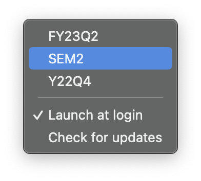

  
  # Twenty Five Cents
  ## Because you need to track your quarters

Twenty Five Cents is a fast, easy way to keep track of the current quarter or semester. It lives quietly in your MenuBar and does little more than keep you apprised of your organization's current planning quarter.

[Download](https://install.appcenter.ms/orgs/rreichel3/apps/25-Cents/distribution_groups/Public)

